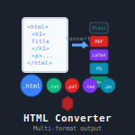

# htmlconvert

[](https://unlicense.org/)
[](https://github.com/isene/htmlconvert/stargazers)
[](https://isene.org)



## Converts html documents to plain text, formatted text, latex, ps or pdf

This program is superseded by wkhtmltopdf (http://wkhtmltopdf.org/). Use the wkhtmltopdf instead as that provides much more functionality. I keep this project here for nostalgia - as it was my first Ruby program (even as it is now broken due to newer Ruby versions).

This program requires the following to be installed on your system: Ruby as well as the utilities html2text, html2ps, ps2pdf and gnuhtml2latex.

These utilities do the actual work; htmlconvert simply gives a common interface to all of them. It also makes it possible to convert several html documents to various formats all in one fell swoop.

**SYNOPSIS:**

    htmlconvert [OPTION] [FORMAT] [URL] [OPTION] [FORMAT] [URL]...

**OPTIONS:**

    -h
	displays the helpfile

    -d
	delete the downloaded html-file to be converted (default)

    -k
	keep the downloaded html-file to be converted

**FORMATS:**

    txt
	convert the html file to plain text (default)

    text
	convert the html file to formatted text 
	(for viewing with less and more)

    latex
	convert the html file to latex

    ps
	convert the html file to postscript

    pdf
	convert the html file to pdf
    
**EXAMPLES:**

By following the synopsis, one could simply convert my homepage to text:

```htmlconvert isene.org/index.html```

Or a more complex use could be:

```htmlconvert -k latex isene.org -d pdf www.ruby-lang.org```
  
This would convert my homepage to a latex file and keep the html file as well. It would then go on to convert the Ruby homepage to pdf, deleting the intermediate html file.

It is possible to convert one document to several formats like:

```htmlconvert text ps isene.org```

By the way; 

```htmlconvert isene.org```

is the same as

```isene.org/index.html```

...or whatever is the top level document for the specific domain.

## License
This software is released into the Public Domain.

